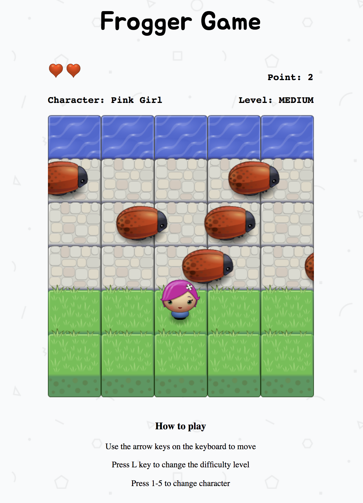

# Frogger Game Clone

## Table of Contents

* [About](#About)
* [Instruction for Installation](#Installtion)
* [How to Play](#How)
* [How the game working](#How)
* [How the game built](#How)

## About

The project is built based on the requirement in Fend Udacity course. It is a Frogger Game Clone which the player try to reach the water without colliding any moving bugs. The player can move up, down, left and right to avoid the bugs. The player have total five characters to choose and three lives to finish the game. The game have three level of difficulty which are easy, medium and hard. On each level, the speed of moving bugs will change in order to prevent the player reach the water. When the player collides any of the bugs, he/she loses one live and begin again at the initial position. As the player reaches the water, he/she earns one point. The game will end as the player uses all his lives. 

## Installation

1. Clone the project to your computer
2. Run index.html in your browser
3. Play the game

## How to Play

* Press 1-5 keys to choose the characters. There are totally five characters
* Press L keys to choose between the three difficulty levels. 
* Use the arrow keys on the keyboard to move the character up, down, left and right
* Try to reach the water without colliding the bugs.
* You will have three lives to finish the game
* If you collide any bugs, you will lost one live
* If you reach the water, you will earn one point
* The game will end as you use all three lives

## How the game working

The goal is the player tries to collect as many points as possible with their three lives. 

* The player presses the arrow keys on the keyboard to move up, down, left and right

* The bugs will appear and moving within the three lines in the game

* The player can choose his/her character by pressing keys 1-5 and select the difficulty level by pressing L keys

* The difficulty level will vary the bugs' speed

* When the game starts or resets or the collision between the player and bugs happens, the player's position will be reset to the defined postion

* When the player hits the water, he/she will earn one point

* When the player collides any bugs, he/she will lose one live

* The game ends as the player uses all their lives

* As the game is over, an popup will appear to inform the total point the player has earned 

## How the game built

HTML, CSS, Vanilla Javacript, canvas HTML 5, and OOP method are used to build the game. The initial design of the game is offered by the instructors of the course. I used Vanilla JS to create class for objects. Besides, I used JS to manipulate the DOM to update information. I altered some part in HTML such as add somes element to display the statistics data and popup.

* Class for objects including Player, Enenmy, and Stat (statistics data)
* Function to check collision between the player and enemies.
* Function to change the characters of the player
* Function to count the point and lives
* Function to display the statisitics data

